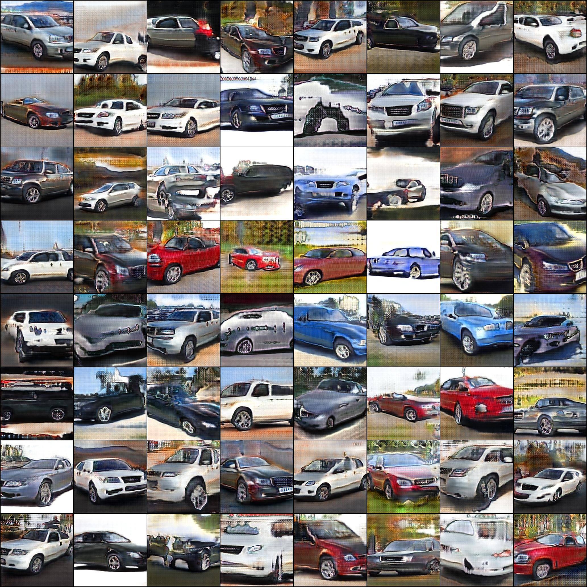

# Gist
Custom GAN with attention block trained on StanfordCars dataset

### Result

<p align="center"><em>Epoch 130</em></p>

### Lightweight
Also lightweight-gan was trained for comparison

```bash
pip install lightweight-gan
lightweight_gan --data .\stanford_cars\ --image-size 256 --batch-size 32 --gradient-accumulate-every 4 --num-train-steps 200000 --aug-prob 0.25 --fp16 --name run1
```

<p align="center"><em>Step 11860</em></p>

